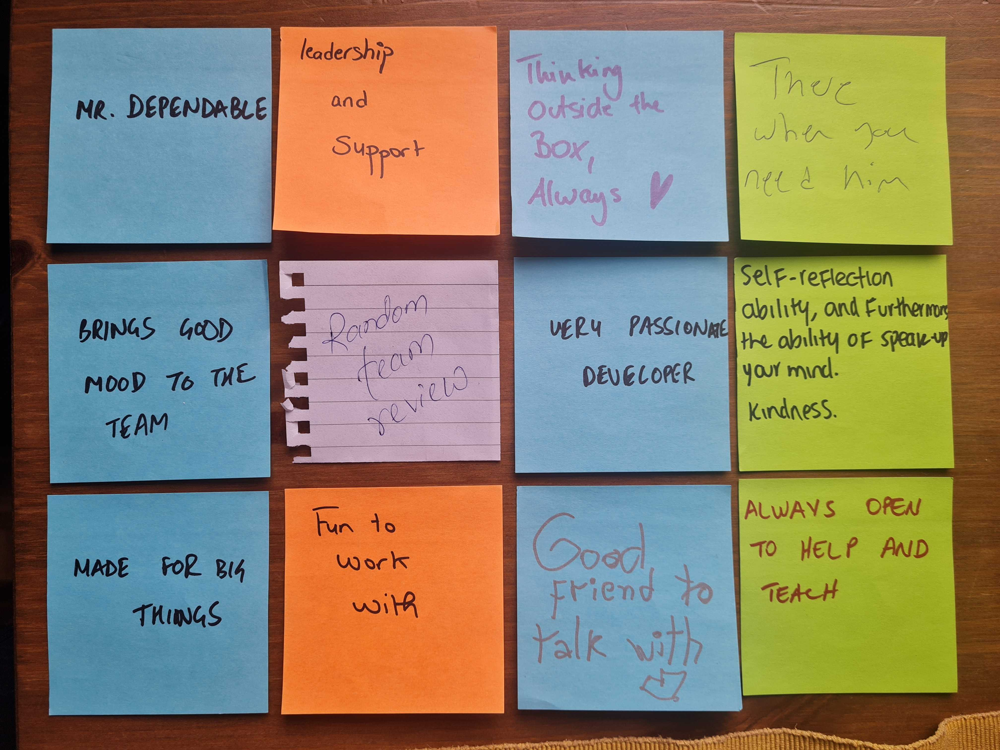

| Type               | Data |
| ---------------------- | ---------------------------------------------------------------------------------------------------------------------------------------------------------------------------------------------------------------------------------------------------------------------------------------------------------------------------------------------------------------------------------------------------------------------------------------------------------------------------------------------------------------------------------------------------------------------------------------------------------------------------------------------------------------------------------------------------------------------------------------------------------------------------------------------------------------------------------------------------------------------------------------------------------------------------------------------------------------------------------------------------------------------------------------------------------------------------------------------------------------------------------------------------------------------------------------------------------------------------------------------------------------------------------------------------------------------------------------------------------------------------------------------------------------------------------------------------------------------------------------------------------------------------------------------------------------------------------------------------------------------------------------------------------------------------------------------------------------------------------------------------------------------------------------------------------------------------------------------------------------------------------------------------------------------------------------------------------------------------------------------------------------------------------------------------------------------------------------------------------------------------------------------------------------------------------------------------------------------------------------------------------------------------------------------------------------------------------------------------------------------------------------------------------------------- |
| Languages              |      |
| Tools / Platforms      |       |
| Frameworks / Libraries |                  |
| Databases and ORMs     |        |
| CI / CD                |    |
| Hosting/SaaS           |       |
| Cloud Services         |                       |
| Reach Me               |    |

### Hi there 👋

- 🔭 I’m currently working on an image compression service
- 🌱 I’m currently learning golang, NestJS, Kubernetes
- 👯 I’m looking to collaborate on open source dev tools
- 🤔 I’m looking for help with 3d models
- 💬 Ask me about Architecture designing, Testing
- 😄 Pronouns: he/him
- ⚡ Fun fact: I still cannot write css from scratch

## Blog Posts

- [Redis Beyond Key-Value Store](https://medium.com/schmiedeone/redis-beyond-key-value-store-b9f7c636be98) - Feb 2, 2024
- [Abstracting Kubernetes with Helm Library Chart](https://medium.com/schmiedeone/abstracting-kubernetes-with-helm-library-chart-4da85c3be8f5) - Sep 8, 2023
- [Avoid using Redux with Realm: Move to a thinner data layer (React Native)](https://medium.com/schmiedeone/avoid-using-redux-with-realm-move-to-a-thinner-data-layer-react-native-8e80cc7b07b3) - Feb 20, 2022
- [i18n routes in Static Sites using NextJS](https://medium.com/schmiedeone/i18n-routes-in-static-sites-using-nextjs-b6a547477bb1) - Aug 20, 2021

More on 

## Things that Matter
Last Edited on: 14th May, 23

- Unit test shared components, modules and the crucial business logics
- Keep a disaster recovery for everything you create
- Avoid over engineering, not everything that looks cool needs to be picked up
- Consider your code a product and your team devs as your clients, sell it with your code readability
